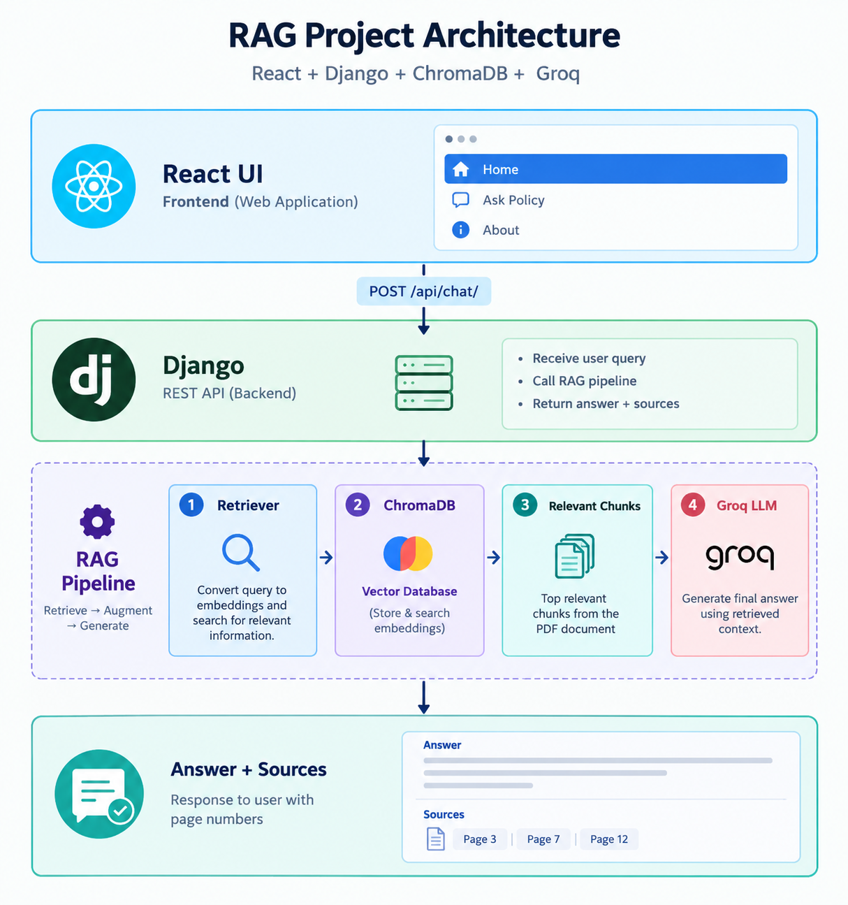

# HR Policy RAG Assistant

An AI-powered **HR Policy Question Answering System** that lets users ask natural-language questions about company HR policies and receive answers grounded in a centralized HR Policy Handbook.

Built with **React, Django REST Framework, LangChain, ChromaDB, Hugging Face embeddings, and Groq**.

## Project Architecture



The request flow is:

```text
React UI
   │
   │ POST /api/chat/
   ▼
Django REST API
   │
   ▼
RAG Pipeline
   │
   ├── Retriever
   │      ▼
   │   ChromaDB
   │      ▼
   │ Relevant Chunks
   │      ▼
   └── Groq LLM
          ▼
     Answer + Sources
```

1. The user submits an HR policy question from React.
2. React sends it to the Django REST API.
3. Django calls the RAG pipeline.
4. The retriever searches ChromaDB for relevant chunks.
5. Retrieved chunks are supplied to the Groq LLM as context.
6. Groq generates the answer.
7. Django returns the answer and relevant PDF page sources.

## Features

- Natural-language HR policy question answering
- Retrieval-Augmented Generation (RAG)
- Single consolidated HR Policy Handbook PDF
- Semantic vector search
- ChromaDB vector database
- Local Hugging Face / Sentence Transformers embeddings
- Groq LLM generation
- Source page references
- Django REST API
- React responsive UI
- React Router DOM
- Tailwind CSS
- Home, Ask Policy, and About pages
- Simple architecture with no authentication or admin dashboard

## Knowledge Base

The project uses one consolidated document:

```text
backend/
└── knowledge_base/
    └── HR_Policy_Handbook.pdf
```

The handbook covers:

- Employee Handbook
- Leave Policy
- Remote Work Policy
- Salary Policy
- Insurance Policy
- Code of Conduct

## Tech Stack

### Frontend

| Technology | Purpose |
|---|---|
| React JS | User interface |
| React Router DOM | Client-side routing |
| Tailwind CSS | Styling |
| Axios | API communication |
| Lucide React | Icons |
| Vite | Development/build tool |

### Backend

| Technology | Purpose |
|---|---|
| Python | Backend language |
| Django | Web framework |
| Django REST Framework | REST API |
| django-cors-headers | CORS support |

### AI / RAG

| Technology | Purpose |
|---|---|
| LangChain | RAG and LLM integration |
| ChromaDB | Vector database |
| Hugging Face / Sentence Transformers | Local embeddings |
| Groq | LLM inference |
| PyPDF | PDF loading |

## RAG Pipeline

The application follows **Retrieve → Augment → Generate**.

### 1. Document Loading

`PyPDFLoader` loads `HR_Policy_Handbook.pdf`.

### 2. Chunking

`RecursiveCharacterTextSplitter` divides the document into smaller chunks.

Current configuration:

```python
chunk_size=800
chunk_overlap=100
```

### 3. Embeddings

The project uses:

```text
sentence-transformers/all-MiniLM-L6-v2
```

to convert text chunks into vector representations.

### 4. ChromaDB

The embeddings are stored in ChromaDB for semantic similarity search.

### 5. Retrieval

For each question, the retriever currently performs:

```python
similarity_search(question, k=4)
```

### 6. Augmentation

The retrieved chunks are combined into the context supplied to the LLM.

### 7. Generation

Groq generates the final answer from the retrieved HR policy context.

The response also includes the PDF pages associated with retrieved chunks.

## Project Structure

```text
hr-policy-rag/
│
├── backend/
│   ├── manage.py
│   ├── config/
│   │   ├── __init__.py
│   │   ├── settings.py
│   │   ├── urls.py
│   │   ├── asgi.py
│   │   └── wsgi.py
│   ├── rag/
│   │   ├── __init__.py
│   │   ├── apps.py
│   │   ├── views.py
│   │   ├── urls.py
│   │   ├── services/
│   │   │   ├── __init__.py
│   │   │   ├── embeddings.py
│   │   │   ├── vector_store.py
│   │   │   ├── retriever.py
│   │   │   ├── llm.py
│   │   │   └── rag_pipeline.py
│   │   └── management/
│   │       └── commands/
│   │           └── ingest_policy.py
│   ├── knowledge_base/
│   │   └── HR_Policy_Handbook.pdf
│   ├── chroma_db/
│   ├── .env
│   ├── .env.example
│   ├── .gitignore
│   └── requirements.txt
│
└── frontend/
    ├── src/
    │   ├── components/
    │   │   ├── layout/
    │   │   │   ├── Navbar.jsx
    │   │   │   ├── Footer.jsx
    │   │   │   └── Layout.jsx
    │   │   ├── ui/
    │   │   │   └── id-card-lanyard.jsx
    │   │   └── PolicyCard.jsx
    │   ├── pages/
    │   │   ├── Home.jsx
    │   │   ├── AskPolicy.jsx
    │   │   └── About.jsx
    │   ├── App.jsx
    │   ├── main.jsx
    │   └── index.css
    ├── components.json
    ├── package.json
    ├── vite.config.js
    └── index.html
```

## Requirements

- Python 3.10+
- Node.js
- npm
- Groq API key

Check versions:

```bash
python --version
node --version
npm --version
```

# Installation

## Backend

### 1. Clone the repository

```bash
git clone <your-repository-url>
cd hr-policy-rag
```

### 2. Open the backend

```bash
cd backend
```

### 3. Create a virtual environment

Windows:

```bash
python -m venv venv
venv\Scripts\activate
```

macOS / Linux:

```bash
python3 -m venv venv
source venv/bin/activate
```

### 4. Install dependencies

```bash
pip install -r requirements.txt
```

Important packages include:

```text
Django
djangorestframework
django-cors-headers
langchain
langchain-community
langchain-chroma
langchain-groq
langchain-huggingface
langchain-text-splitters
chromadb
sentence-transformers
pypdf
python-dotenv
```

### 5. Configure environment variables

Create `backend/.env`:

```env
GROQ_API_KEY=your_groq_api_key_here
```

Never commit the real `.env` file.

### 6. Add the policy PDF

Place the handbook here:

```text
backend/knowledge_base/HR_Policy_Handbook.pdf
```

### 7. Run migrations

```bash
python manage.py migrate
```

### 8. Ingest the PDF

```bash
python manage.py ingest_policy
```

This loads the PDF, creates chunks, generates embeddings, and stores them in ChromaDB.

### 9. Start Django

```bash
python manage.py runserver
```

Backend:

```text
http://127.0.0.1:8000/
```

API:

```text
http://127.0.0.1:8000/api/chat/
```

## Frontend

Open a second terminal:

```bash
cd frontend
```

Install dependencies:

```bash
npm install
```

If setting up the frontend from scratch:

```bash
npm install react-router-dom axios lucide-react
npm install tailwindcss @tailwindcss/vite
```

Start the development server:

```bash
npm run dev
```

Frontend:

```text
http://localhost:5173
```

## API

### Chat endpoint

```http
POST /api/chat/
Content-Type: application/json
```

Request:

```json
{
  "question": "How many annual leaves can I take?"
}
```

Example response:

```json
{
  "answer": "Employees are entitled to 20 days of annual leave per year.",
  "sources": [
    {
      "document": "HR Policy Handbook",
      "page": 4
    }
  ]
}
```

If no question is supplied:

```json
{
  "error": "Question is required."
}
```

## Application Pages

### Home

Introduces the HR Policy AI Assistant and provides access to the main policy areas.

### Ask Policy

Users can enter questions such as:

```text
How many annual leaves can I take?
Can I work remotely?
What is the salary payment policy?
What does the code of conduct say?
What insurance benefits are provided?
```

The page displays the generated answer and source PDF pages.

### About

Explains the RAG architecture and technology stack.

## Environment Variables

| Variable | Description |
|---|---|
| `GROQ_API_KEY` | API key used for Groq LLM access |

Example:

```env
GROQ_API_KEY=your_groq_api_key_here
```

## Vector Database

ChromaDB data is stored locally in:

```text
backend/chroma_db/
```

This directory should normally be excluded from Git.

### Important ingestion note

The current ingestion command adds documents to the collection. Running it repeatedly without clearing/rebuilding the collection can create duplicate chunks.

If the policy PDF changes, rebuild or clear the existing collection as appropriate before re-ingesting.

## Security

This project intentionally does not include:

- User authentication
- Authorization
- Role-based access control
- Admin dashboard

For production, configure CORS, secret management, HTTPS, rate limiting, authentication, and other security controls according to the deployment environment.

## Troubleshooting

### PDF not found

Confirm:

```text
backend/knowledge_base/HR_Policy_Handbook.pdf
```

Then run:

```bash
python manage.py ingest_policy
```

### Groq API key error

Check that `backend/.env` contains:

```env
GROQ_API_KEY=your_groq_api_key_here
```

Restart Django after changing environment variables.

### Frontend cannot connect to backend

Confirm both servers are running:

```text
Frontend: http://localhost:5173
Backend:  http://127.0.0.1:8000
```

Also check that the frontend sends requests to:

```text
http://127.0.0.1:8000/api/chat/
```

### ChromaDB returns no results

Run:

```bash
python manage.py ingest_policy
```

and verify that:

```text
backend/chroma_db/
```

contains the ChromaDB data.

## Why RAG?

A general LLM does not automatically know the contents of a private company HR handbook.

RAG provides the model with relevant company-specific information at query time:

```text
HR Policy Documents
        │
        ▼
     Chunking
        │
        ▼
    Embeddings
        │
        ▼
     ChromaDB
        │
        │ User Question
        ▼
Relevant Context
        │
        ▼
      Groq LLM
        │
        ▼
Grounded Answer
```

This pattern can also be applied to internal documentation, manuals, procedures, knowledge bases, and other organization-specific documents.

## Project Goals

- Demonstrate a practical RAG application
- Make HR policies easier to search
- Combine React with a Django backend
- Demonstrate semantic vector retrieval
- Return source references with generated answers
- Integrate LangChain, ChromaDB, local embeddings, and an LLM API

## Future Improvements

Possible future extensions include:

- Conversation history
- Streaming responses
- Improved citation UI
- Multiple document support
- Document upload
- Automatic re-indexing
- Hybrid keyword + vector search
- Reranking
- RAG evaluation
- Authentication and authorization
- Rate limiting
- Cloud deployment

## Author

**Fahim Hassan**

AI/ML-focused full-stack RAG project using React and Django.

## License

Add your preferred license here, for example:

```text
MIT License
```

Update this section according to your repository or university project requirements.
